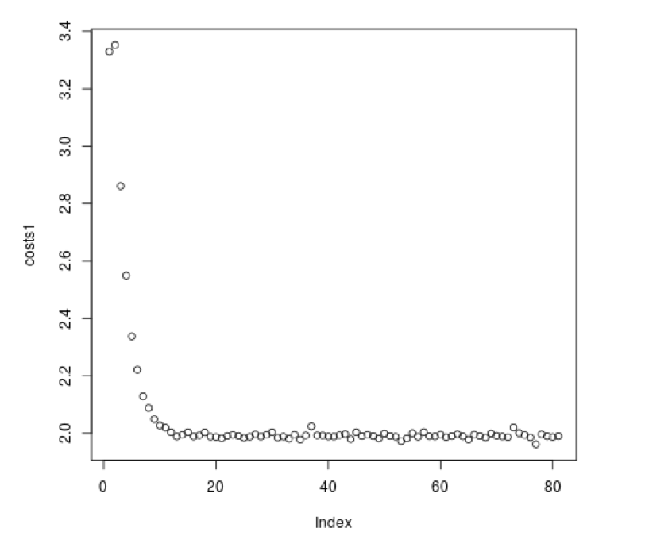

## Neural Network Implementation for Solving Nim ##

**Author**
* Farhang Rouhi

**Introduction**

This is a project to develop a neural network from scratch without any special packages. The objective of this project is to understand and practice fundamentals of neural networks, especially mathematical foundations such as gradient descent. We develop the neural net to solve the game of Nim because finding the correct solution to Nim is simple, but the game itself is relatively complex.

**What is Nim?**

Nim is a mathematical game with two players and multiple piles of objects. Here we use three piles where each pile has up to 64 objects at the beginning of the game. Players take turns. Each player can remove any positive number of objects away only from one pile. The player that cannot move looses the game. Note that this happens when no objects are left in any pile. The solution of this game is to calculate the XOR of two piles (in binary). Then, we should take enough objects away from the third pile to convert it to the result of the XOR. In other words, we should make the XOR of three piles equal to 0 at each turn.

**How does it work?**

The code first generates some data. This data is coming from using XORs and creating all possible combinations of pile numbers and their expected correct result. After we have the data, the code creates its neural network. To do that, it shuffles the data and splits it to two halves (one for testing and one for training). Then we split the training data set into smaller lists which have the size of 2000 and they act as our batches. Then we call our back-propagation function. I have experimented with two back-propagation functions and I have used three activation functions (ReLU, Leaky ReLU, and Sigmoid). My results and analysis and based on the ReLU function. The back-propagation works as expected and after all batches are done for each epoc, we call the test function. The test function gets the average of the costs. The forward propagation works as expected via matrix multiplication.
Note that I have two files. neural_net_trainer and neural_net_trainer_V2. The first one gives the results in binary and 9 outputs. The second one gives the results in 2 digits. Nim.py allows us to find the optimal solution for a given position or play a full game using our neural net.

**Analysis**

running the neural_net_trainer on multiple epocs gives us the following graph of cost/epoc:
_Note that the plot is generated using R_

**How to Play The Game?**

You can play the game against the trained neural network. First, run Nim.py script and enter "full" to play a full game.
Then, specify sizes of three piles. After that, the game starts.
When it is your turn, select a pile and the new size of that pile. Note that the new size has to be smaller than the original size.
The goal is to make all piles zero. The player who makes all of the piles empty wins the game.

**Important Note:**

this project is only to practice basics and mathematical foundations of neural networks. This is not the fastest nor the most efficient method. One improvement would be to use numpy for all matrix/vector multiplications which would make the code much faster. Even better, we could write a much more accurate neural net using TensorFlow with a few lines of code. 